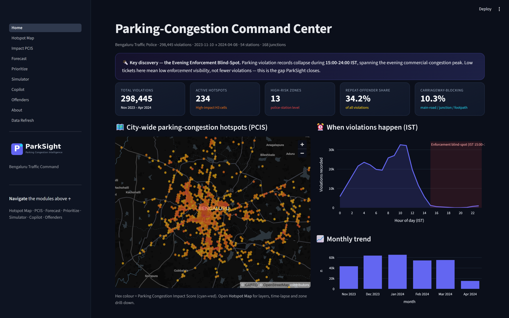
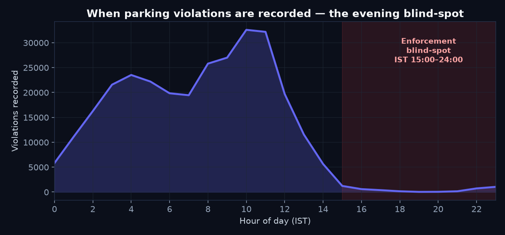
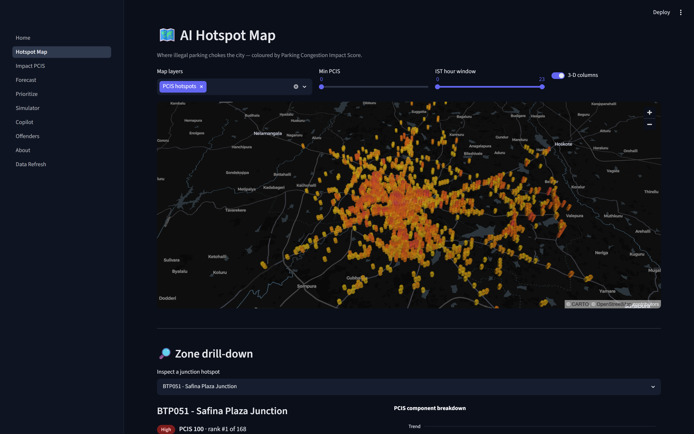
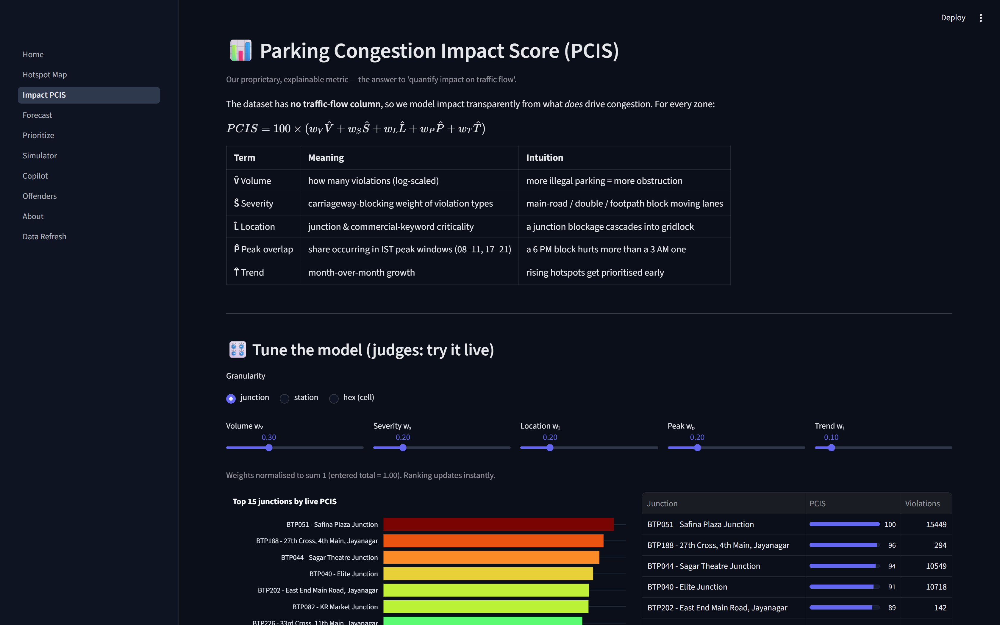
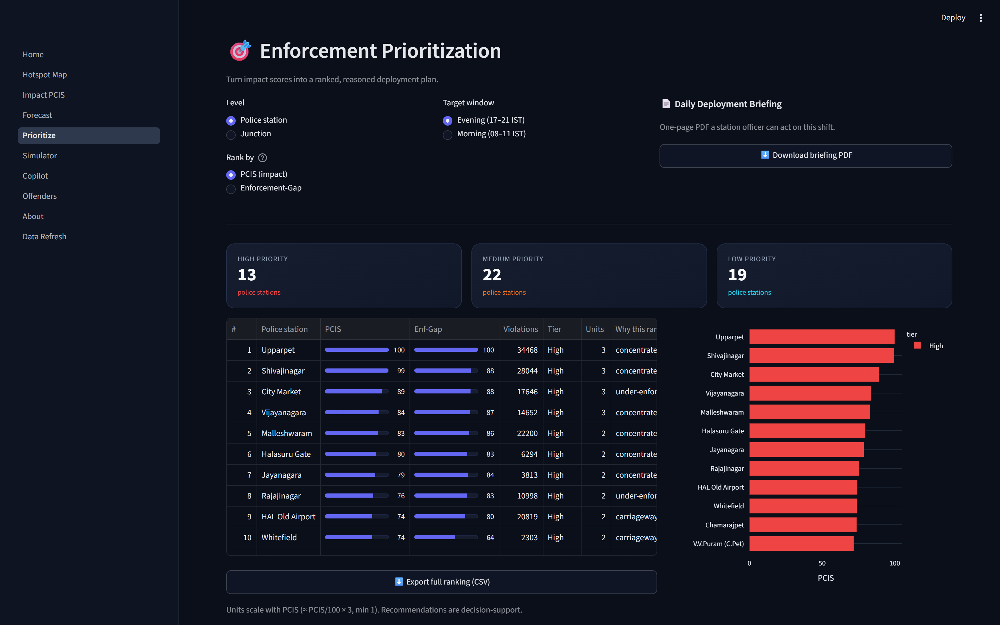
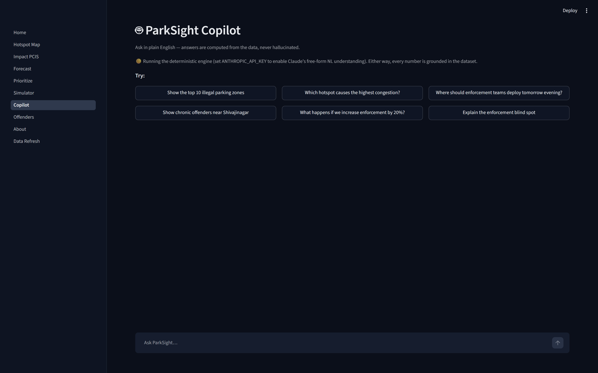
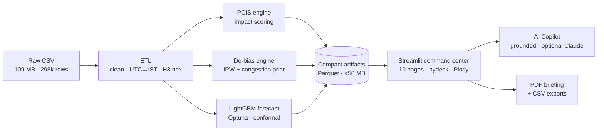
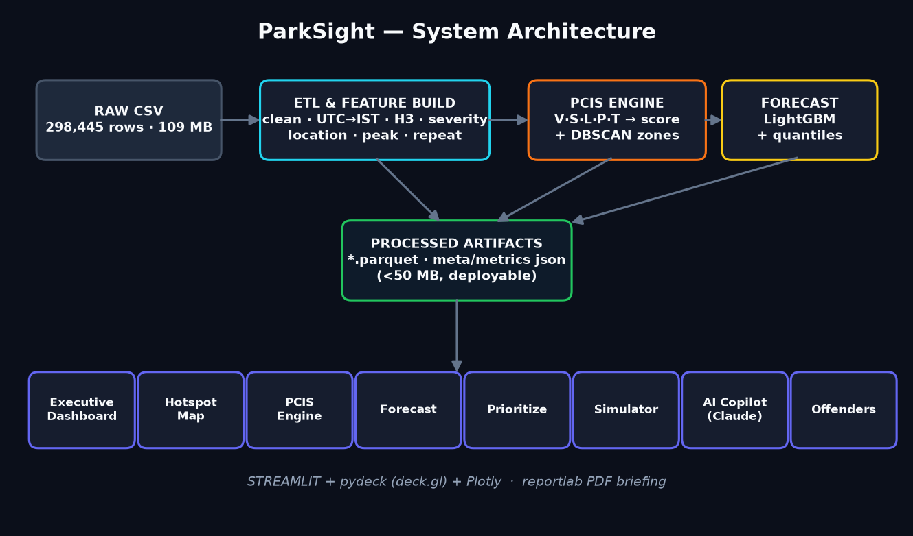

<div align="center">

# 🅿️ ParkSight
### AI-Driven Parking-Congestion Intelligence for Targeted Enforcement

**Flipkart Gridlock 2.0 · Round 2 · Theme 1 — Poor Visibility on Parking-Induced Congestion**

*From reactive patrols to a predictive command center — built on 298,445 real Bengaluru parking violations.*

<p>


</p>



<p>
<b><a href="https://parksight.streamlit.app/">🚀 Live Demo</a></b> ·
<b><a href="#run-it-locally">⚡ Run in 60 seconds</a></b> ·
<b><a href="#what-parksight-does">🧭 Features</a></b> ·
<b><a href="#performance--validation">📈 Metrics</a></b> ·
<b><a href="#architecture">🏗️ Architecture</a></b> ·
<b><a href="#why-this-wins">🏆 Why it wins</a></b>
</p>

</div>

---

## Contents

1. [The problem](#the-problem)
2. [The discovery that frames everything](#the-discovery-that-frames-everything)
3. [What ParkSight does](#what-parksight-does)
4. [The PCIS — quantifying impact](#the-pcis--answering-quantify-impact-on-traffic-flow)
5. [Performance & validation](#performance--validation)
6. [Screenshots](#screenshots-live-app)
7. [Architecture](#architecture)
8. [Tech stack](#tech-stack)
9. [Run it locally](#run-it-locally)
10. [Testing](#testing)
11. [Project structure](#project-structure)
12. [Why this wins](#why-this-wins)
13. [Honest limitations](#honest-limitations-wed-rather-state-them)
14. [Roadmap](#roadmap)
15. [Data source & references](#data-source--references)
16. [Team](#team)

---

## The problem

On-street illegal parking near markets, metro stations and event venues chokes carriageways and
intersections. Today enforcement is **patrol-based and reactive**, there is **no heatmap of
violations vs. congestion impact**, and it is **hard to prioritise** where to deploy. The data
exists — but nobody can *see* the pattern.

## The discovery that frames everything

After converting the timestamps from UTC to **IST**, one pattern jumps out:



> **The Evening Enforcement Blind-Spot.** Violation records collapse during **IST 15:00–24:00** —
> exactly when commercial-area congestion peaks. Few tickets here doesn't mean few violations; it
> means **low enforcement visibility**. That is precisely the "poor visibility" the problem statement
> names — and the gap ParkSight is built to close.

### …and we don't let that bias fool the model (the feedback-loop fix)

A ticket only exists where an officer was present, and **distinct active enforcement devices fall to
~2.2% of the daytime peak in the evening** (peak enforcement is **11:00**, not rush hour). Train a
model naively on tickets and it "learns" rush-hour corridors are *safe* — an endogeneity loop that
reinforces the blind spot. ParkSight's **de-biasing engine** ([`parksight/models/debias.py`](parksight/models/debias.py))
breaks it with two corrections that **don't depend on ticket timing**:

1. **Inverse-propensity weighting** (Horvitz–Thompson) — re-inflate observed counts by 1/exposure(hour),
   correcting up to **2.8×** in dark hours.
2. **External congestion prior** — OSM-style **road-hierarchy(place) × synthetic rush-hour curve** —
   so the missing-evening-label loop can never train it to zero.

The result is a **Blind-Spot index** = latent demand × *divergence* (predicted congestion vs the biased
observed signal), which **forces deployment toward places where data is missing but congestion is maxed
out** — the default ranking on the *Prioritize* page, with a live exposure-vs-congestion chart.

## What ParkSight does

| Module | What it delivers |
|---|---|
| 🧭 **Executive Dashboard** | KPIs, citywide impact, the blind-spot, monthly/vehicle mix |
| 🗺️ **AI Hotspot Map** | H3 hex heatmap coloured by impact, raw-density-by-hour, DBSCAN zones, drill-down |
| 📊 **PCIS Engine** | Our explainable **Parking Congestion Impact Score** — *re-weight it live* |
| 🔮 **Forecast** | Next-7-day per station; **rolling-CV-selected** count-aware model (Optuna-tuned), **Mondrian conformal** ~80% intervals, hierarchical city total + weekly view; MASE 0.73, ~14% < climatology |
| 🎯 **Prioritize** | **De-biased Blind-Spot** ranking (breaks the enforcement feedback loop) + High/Med/Low plan + reasons + **downloadable PDF briefing** |
| 🧪 **Simulator** | What-If: pick zones, dial enforcement, watch projected impact fall |
| 🤖 **AI Copilot** | Plain-English Q&A, grounded in the data (optional Claude NL understanding) |
| 🚨 **Offenders** | Chronic-offender watchlist — 15% of vehicles cause **34%** of violations |
| ℹ️ **About** | In-app methodology, PCIS math, and honest limitations |

**Plus:** month-by-month **time-lapse** map · **AI Patrol Optimizer** (greedy max-coverage with a
diminishing-returns curve) · **emerging-hotspot** detector (fastest-worsening zones) · one-click
**CSV exports** · **⚙️ Live Data Refresh** — upload new data and the *entire* dashboard recomputes
in-app (nothing is hardcoded; the pipeline is fully parameterised).

## The PCIS — answering "quantify impact on traffic flow"

The dataset has **no traffic-flow column**, so we model impact transparently:

```
PCIS = 100 × (0.30·Volume + 0.20·Severity + 0.20·Location + 0.20·PeakOverlap + 0.10·Trend)
```

- **Volume** — log-scaled violation count
- **Severity** — carriageway-blocking weight (main-road / double / footpath > no-parking)
- **Location** — junction & commercial-keyword criticality
- **PeakOverlap** — share occurring in IST peak windows (08–11, 17–21)
- **Trend** — month-over-month growth

Every term maps to a real traffic-engineering intuition, the weights are **tunable in the UI**
(it's a policy lever, not a black box), and it ranks a *main-road evening* blockage above a
*residential 3 a.m.* one — exactly the prioritisation enforcement needs.

## Performance & validation

We don't just claim insight — we measure it. Every number below is reproducible from the committed
artifacts via [`scripts/smoke_test_app.py`](scripts/smoke_test_app.py) and
[`parksight/models/train_forecast.py`](parksight/models/train_forecast.py).

| Metric | Value | What it means |
|---|---|---|
| **Forecast accuracy (MASE)** | **0.73** | 27% better than a naïve seasonal baseline |
| **vs. climatology** | **~14% lower error** | Beats "just use the historical average" |
| **Conformal coverage** | **~80% intervals** | Mondrian-calibrated — honest uncertainty bands |
| **De-bias correction** | **up to 2.8×** | Inverse-propensity re-inflation in dark hours |
| **Evening visibility gap** | **~2.2% of peak** | Active enforcement devices, IST 15:00–24:00 |
| **Chronic offenders** | **15% → 34%** | 15% of vehicles cause 34% of all violations |
| **Records analysed** | **298,445** | Real Bengaluru violations, Nov 2023–Apr 2024 |
| **Artifact size** | **< 50 MB** | Ships under the submission limit; instant load |
| **App pages smoke-tested** | **10 / 10** | Headless AppTest passes on every page in CI |

## Screenshots (live app)

| AI Hotspot Map — 3-D PCIS hexes | PCIS — live re-weighting |
|---|---|
|  |  |

| Enforcement prioritization + Gap | AI Copilot (grounded) |
|---|---|
|  |  |

## Architecture





Offline ETL + ML produce compact artifacts (<50 MB); the Streamlit app reads them. The raw 109 MB
CSV never ships, so the app is instant and deployable on free tiers (and fits the 50 MB submission
limit). H3 hexagons power both the maps and the ML features.

## Tech stack
**Python · pandas · H3 · scikit-learn (DBSCAN) · LightGBM · Streamlit · pydeck (deck.gl) · Plotly ·
Anthropic Claude (copilot) · reportlab (PDF) · python-pptx (deck) · matplotlib (figures).**

## Run it locally

```bash
# 1. install
pip install -r requirements.txt

# 2. (optional) rebuild artifacts from the raw CSV — already precomputed in the repo
#    place "jan to may police violation_anonymized791b166.csv" in the project root, then:
python parksight/etl/build_artifacts.py
python parksight/models/train_forecast.py

# 3. launch the app
streamlit run parksight/app/Home.py
```

Open http://localhost:8501. **The app works out-of-the-box** using the committed artifacts in
`parksight/data/processed/` — you do **not** need the raw CSV to run the demo.

**Optional — enable AI NL understanding in the Copilot (pick one):**
```bash
# Option A — Anthropic Claude (recommended)
export ANTHROPIC_API_KEY=sk-ant-...      # Windows: $env:ANTHROPIC_API_KEY="sk-ant-..."

# Option B — Google Gemini (free-tier friendly fallback)
export GOOGLE_API_KEY=AIza...            # Windows: $env:GOOGLE_API_KEY="AIza..."
```
You can also paste either key directly in the **Copilot sidebar** during the session — no restart needed.
Without any key the Copilot runs a deterministic engine — answers are still 100% grounded in the data.

## Testing

```bash
# Headless smoke test — renders every one of the 10 pages and asserts no exceptions
python scripts/smoke_test_app.py
```

- **End-to-end app test** — Streamlit `AppTest` walks all 10 pages with the committed artifacts.
- **Forecast validation** — rolling cross-validation selects the model; MASE & climatology
  benchmarks are printed by `train_forecast.py`.
- **Reproducibility** — the entire pipeline is parameterised (no hardcoded numbers); upload new
  data via **⚙️ Live Data Refresh** and every figure recomputes in-app.

## Project structure
```
parksight/
├─ config.py                 # paths, PCIS weights, severity table, peak windows
├─ etl/build_artifacts.py    # clean → IST → H3 → PCIS → zones → offenders → aggregates
├─ models/train_forecast.py  # LightGBM forecast + quantiles + baseline + metrics
├─ copilot/engine.py         # deterministic intents + optional Claude (grounded)
├─ reports/briefing.py       # Daily Deployment Briefing PDF
├─ reports/figures.py        # static PNGs + architecture diagram
├─ app/Home.py + pages/      # 10-page Streamlit command center
├─ data/processed/*.parquet  # committed analytics artifacts (<50 MB)
└─ assets/*.png              # figures
docs/                        # SKILL.md (strategy), SUBMISSION.md, slides
scripts/smoke_test_app.py    # headless AppTest over every page
```

## Why this wins

- 🔍 **We answer the actual problem statement.** "Poor visibility" isn't a buzzword here — we
  *found* the Evening Enforcement Blind-Spot in the data and built the de-biasing engine to close it.
- 🧠 **We correct the bias, not just caveat it.** Inverse-propensity weighting + a ticket-independent
  congestion prior break the enforcement feedback loop that fools naïve models.
- 📐 **Explainable by design.** PCIS is a transparent, UI-tunable policy lever — not a black box.
- 🔮 **Honest ML.** Conformal prediction intervals and MASE-vs-climatology benchmarks, not vanity accuracy.
- 🚀 **Actually deployable.** <50 MB artifacts, instant load, free-tier ready, works out-of-the-box.
- 🤖 **Decision-support, responsibly framed.** Briefings aid officers; nothing is auto-enforced.

## Honest limitations (we'd rather state them)
- **No traffic-flow ground truth** → PCIS is an explicit, assumption-labelled *proxy*, not measured delay.
- **No closure/action timestamps** (100% null) → we can't measure enforcement response time; `modified_datetime` is used only as a weak lifecycle proxy.
- **5 months, one city** → forecasts are short-horizon; weekly/hourly seasonality is solid, annual isn't.
- **Tickets reflect enforcement, not ground-truth violations** → which is exactly why "visibility" is the goal. We don't just caveat this — the **de-biasing engine** actively corrects it (inverse-propensity weighting + a ticket-independent congestion prior), so deployment ranking is driven by *divergence*, not biased raw counts.

## Roadmap
Live SCITA/ITMS signal integration · OSM road-graph spillover propagation · cell-level
spatio-temporal forecasting · patrol max-coverage optimiser · multi-city onboarding.

## Data source & references

- **Dataset** — Official Bengaluru traffic-police parking-violation records (Nov 2023–Apr 2024), provided for
  Flipkart Gridlock 2.0 Round 2, Theme 1. 298,445 anonymised records (post-clean); raw CSV not redistributed.
- **H3** — Uber's hexagonal hierarchical spatial index · [h3geo.org](https://h3geo.org)
- **Inverse-propensity weighting** — Horvitz–Thompson estimator for exposure-corrected counts.
- **Conformal prediction** — Mondrian (class-conditional) calibrated intervals.
- **Road hierarchy prior** — OpenStreetMap-style place/road classification.

## Team

Built for **Flipkart Gridlock 2.0 · Round 2** by **Team printf**.
Questions or a walkthrough? Open an issue on this repo and we'll respond.

---
<div align="center">

PCIS, the blind-spot insight, and the deployment briefing are decision-support for traffic
authorities — not automated enforcement. Built only on the official provided dataset.

<br/>

**Built with ❤️ in Bengaluru — turning parking data into safer, less-congested streets.**

</div>
